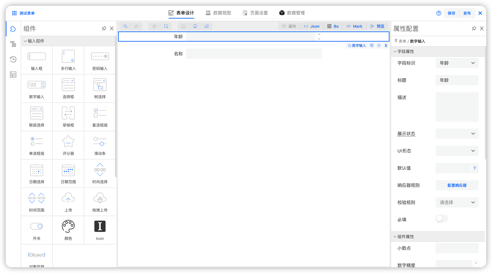

English | [简体中文](./README.md)


<h2 align="center">Simple · Practical · Leading Edge · Innovation</h2>

## Overview

Here is a minimalist-style backend management UI framework.
👉[[Turbo]back-end](https://github.com/ClearXs/Turbo.git)

## Features

- 👊 Simple: Incorporating Semi-UI for a crisp and refreshing interface style.
- 💢 Leading Edge: The built-in form designer based on Alibaba's Designable for secondary development.
- 🥮 State Manager: Utilizing Recoil for internal state management of the built-in components.
- 🏟 Practical: In addition to the provided form designer, it also boasts a wide array of user-friendly components.
- ...

## Install

```bash
npm install
```

## Run

```bash
npm run dev
```

## Package

```bash
npm run build
```

## Preview

<table>
    <tr>
        <td></td>
        <td></td>
        <td></td>
    </tr>
    <tr>
        <td></td>
        <td></td>
        <td></td>
    </tr>
    <tr>
        <td></td>
        <td></td>
      	<td></td>
    </tr>
</table>
