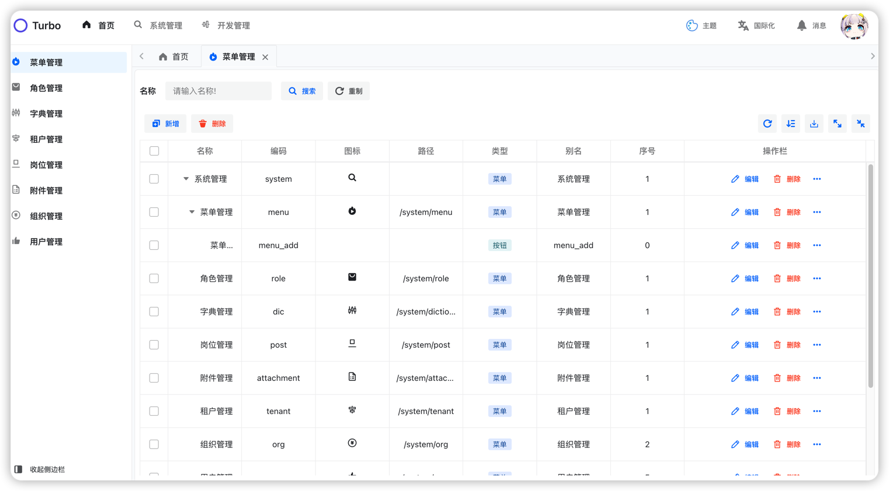
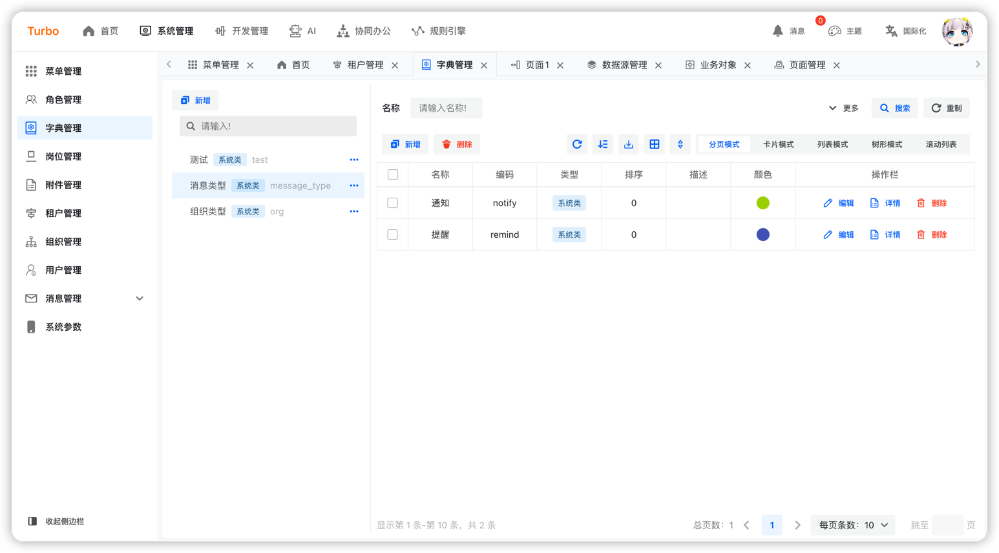
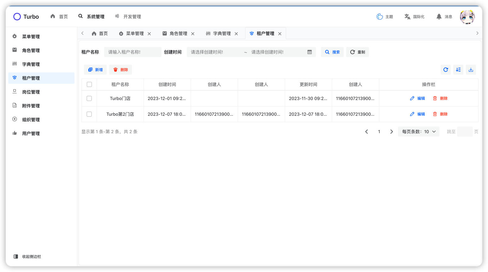
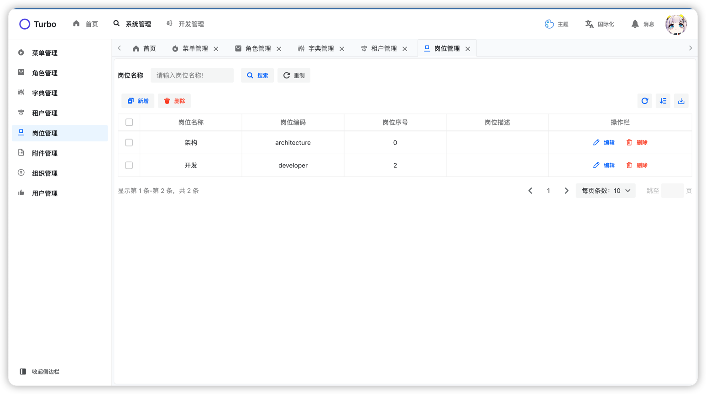
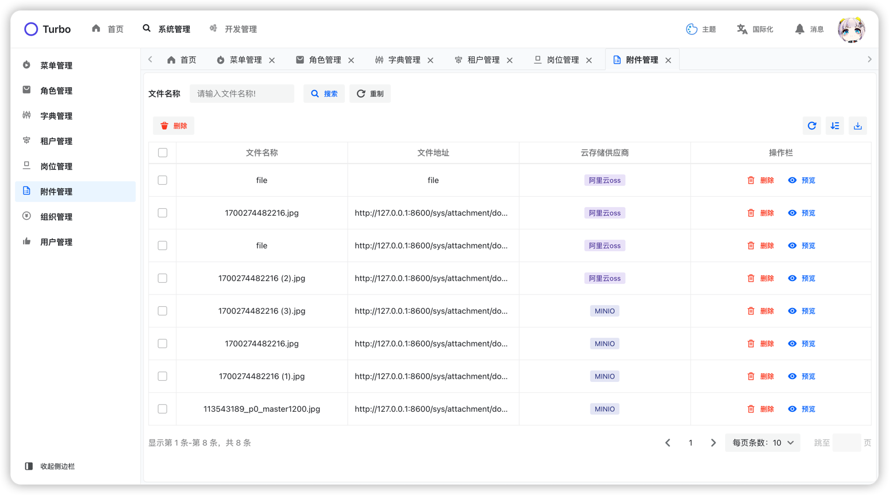
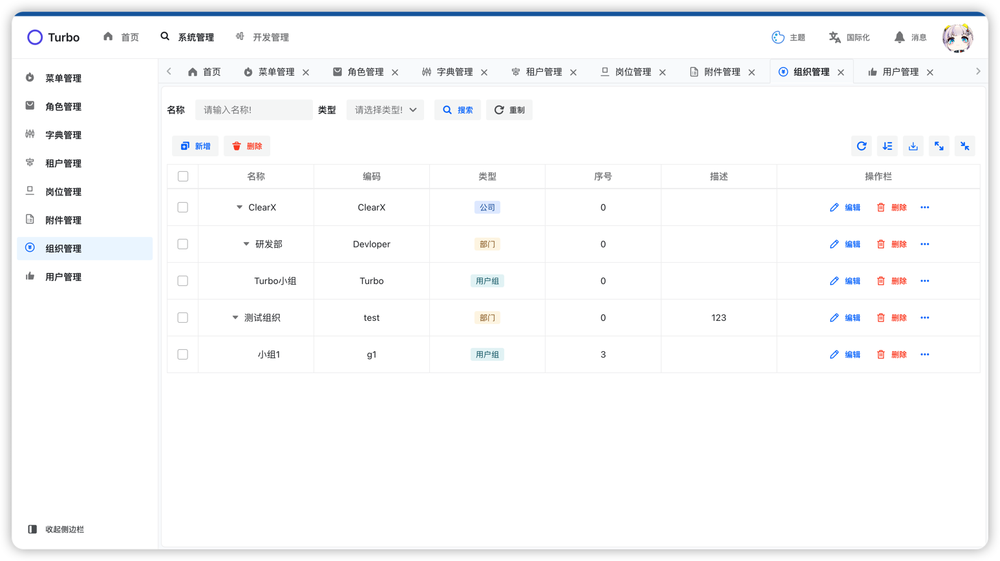
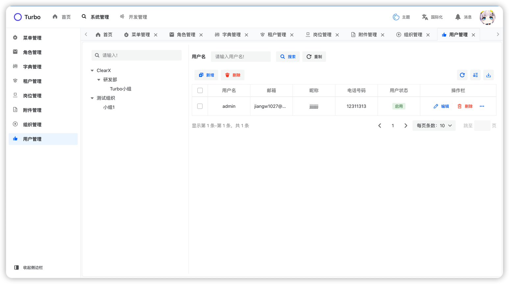

[English](./README.en-US.md) | 简体中文


<h2 align="center">简约 · 实用 · 前沿 · 创新</h2>

## 概要

这是一个简约风的后台管理ui框子，👉[[Turbo]后端](https://github.com/ClearXs/Turbo.git)

## 特性

- 👊 简约：使用semi-ui提供清爽的界面风格
- 💢 前沿：内置基于alibab的designable二开的表单设计器
- 🥮 状态管理：使用recoil对内置进行状态管理
- 🏟 实用：除了提供的表单设计器，还拥有大量易于使用的组件
- ...

## 安装

```bash
npm install
```

## 运行

```bash
npm run dev
```

## 打包

```bash
npm run build
```

## 界面预览

<table>
    <tr>
        <td></td>
        <td></td>
        <td></td>
    </tr>
    <tr>
        <td></td>
        <td></td>
        <td></td>
    </tr>
    <tr>
        <td></td>
        <td></td>
    </tr>
</table>
