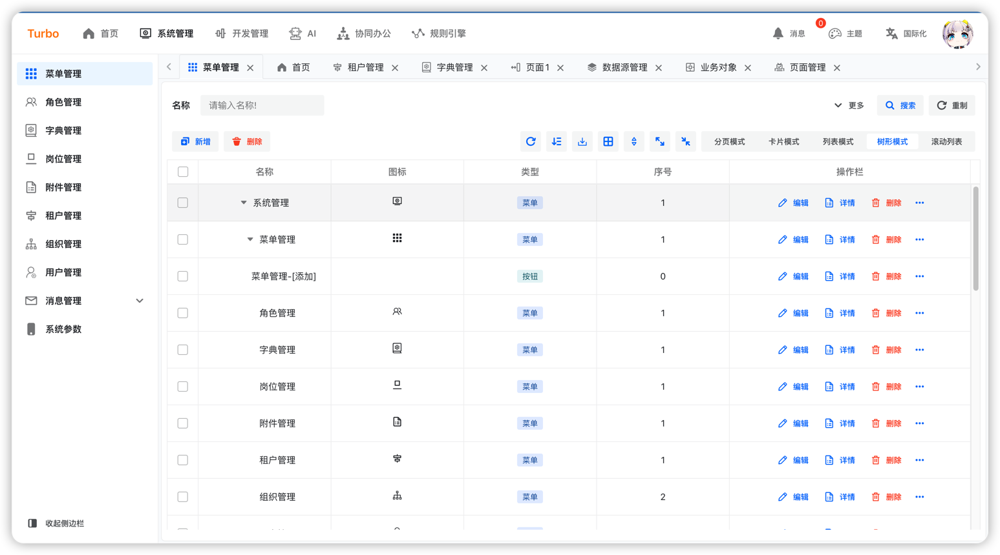
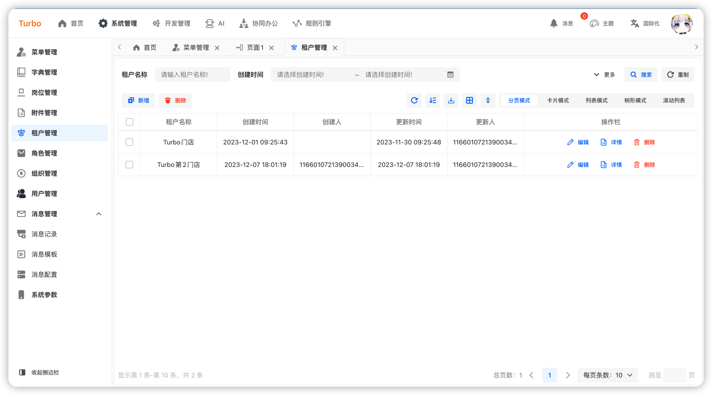
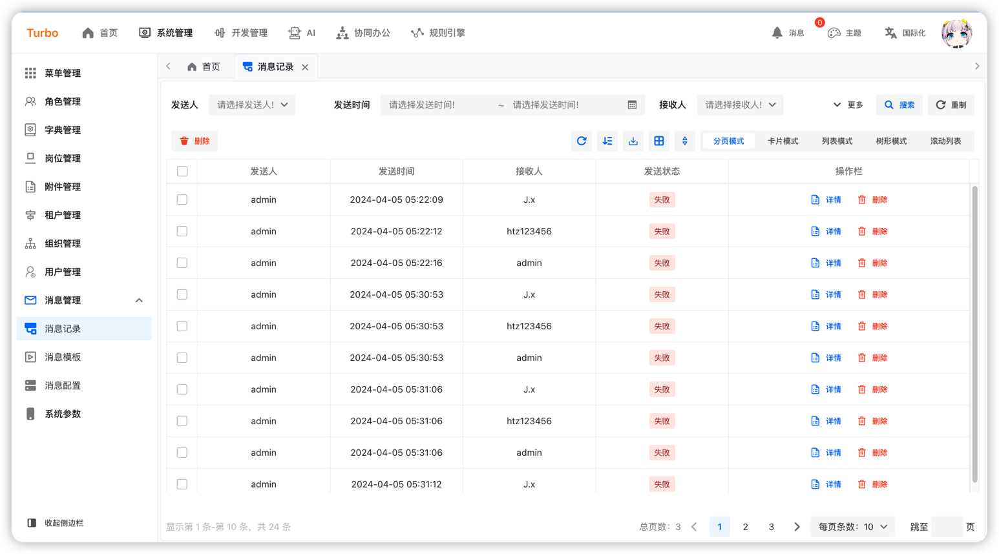
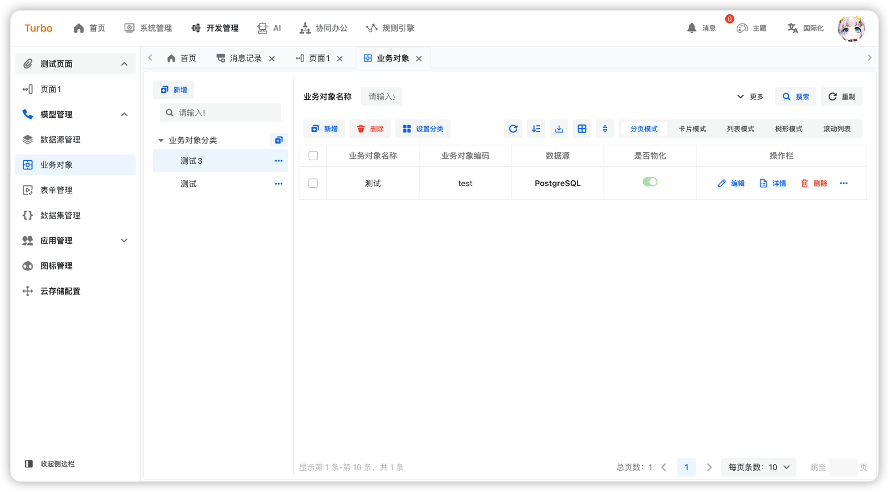
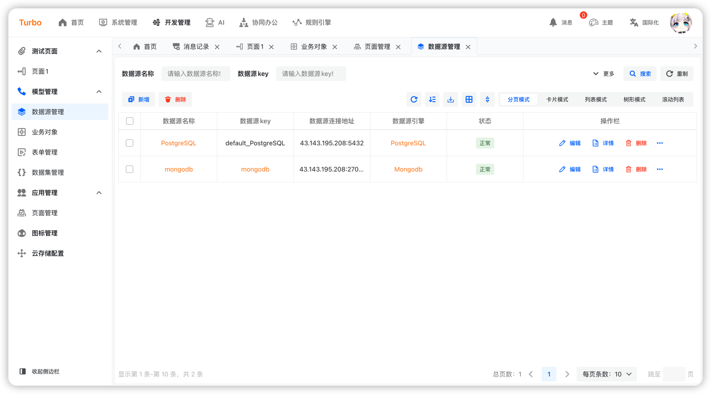

<h2 align="center">简约 · 实用 · 前沿 · 创新</h2>

## 概要

这是一个简单，实用的后台管理UI骨架，可以快速查看👉[[Turbo]后端](https://github.com/ClearXs/Turbo.git)

## 特性

- 👊 简约：使用semi-ui提供UI风格。
- 💢 前沿：内置基于formliy和designable二开的表单设计器。
- 🥮 状态管理：使用mobx对内置进行状态管理。
- 🏟 实用：除了提供的表单设计器，还拥有大量易于使用的组件。
- :gear:配置化：通过简单的json就可以快速配置出CRUD页面。
- ...

## Prerequisite

- Node.js版本: >=v18.0.0
- npm版本: >=9.0.0

## 安装

```bash
pnpm install
```

## 运行

```bash
pnpm run dev
```

## 打包

```bash
pnpm run build
```

## 浏览器支持

| [](https://cdnjs.cloudflare.com/ajax/libs/browser-logos/70.4.0/chrome/chrome.png)<br>chrome | [](https://cdnjs.cloudflare.com/ajax/libs/browser-logos/70.4.0/firefox/firefox.png)<br>firefox | [](https://cdnjs.cloudflare.com/ajax/libs/browser-logos/70.4.0/safari/safari.png)<br>safari | [](https://cdnjs.cloudflare.com/ajax/libs/browser-logos/70.4.0/edge/edge.png)<br> IE/Edge | [](https://cdnjs.cloudflare.com/ajax/libs/browser-logos/70.4.0/electron/electron.png)<br>Electron |
| ----------------------------------------------------------------------------------------------------------------------------------------------------------------------------------------------------------------------------------------- | ------------------------------------------------------------------------------------------------------------------------------------------------------------------------------------------------------------------------------------ | ------------------------------------------------------------------------------------------------------------------------------------------------------------------------------------------------------------------------------ | ------------------------------------------------------------------------------------------------------------------------------------------------------------------------------------------------------------ | ----------------------------------------------------------------------------------------------------------------------------------------------------------------------------------------------------------------------------- |
| latest 2 versions                                                                                                                                                                                                                         | latest 2 versions                                                                                                                                                                                                                    | latest 2 versions                                                                                                                                                                                                              | Edge                                                                                                                                                                                                         | latest 2 versions                                                                                                                                                                                                             |

## 界面预览

<table>
    <tr>
        <td></td>
        <td></td>
        <td></td>
    </tr>
    <tr>
        <td></td>
        <td></td>
        <td></td>
    </tr>
    <tr>
        <td></td>
        <td></td>
        <td></td>
    </tr>
</table>
